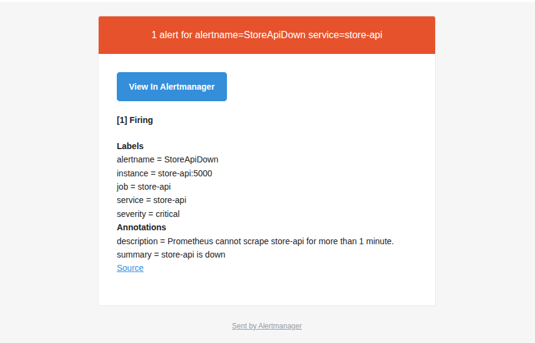
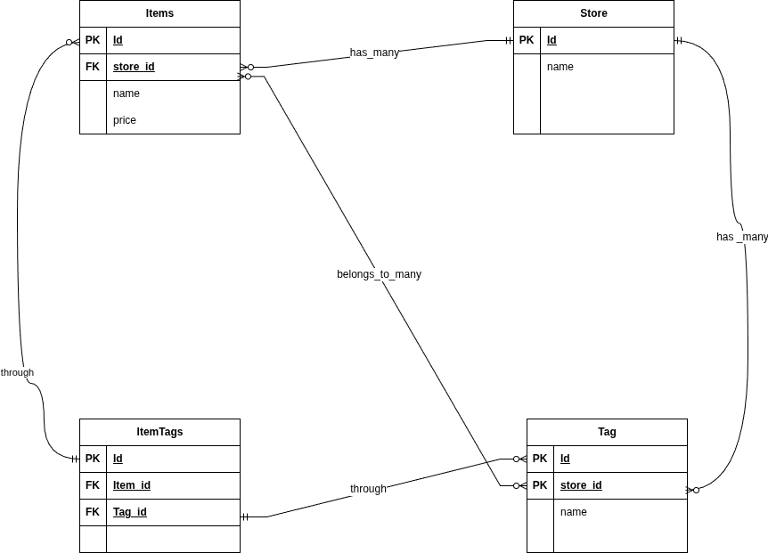

# Store API (Flask + Postgres) — Retail Backend (Amazon-like)

A production-style REST API for managing **Stores**, **Items**, and **Tags** — with **JWT authentication**, **schema validation**, **migrations**, and **OpenAPI/Swagger docs**.

> Built as a portfolio backend project to demonstrate real-world API design, entity relationships, and containerized local development.

---

## Features

- **Stores / Items / Tags** domain (Retail logic)
- **Link/Unlink Items ↔ Stores**
- **Tag Items** (many-to-many)
- **Store search** and **store item count**
- **JWT Authentication** (access + refresh + logout)
- **Validation & serialization** via schemas (Flask-Smorest)
- **Error handling** (consistent API errors)
- **PostgreSQL** persistence
- **Database migrations** (Alembic/Flask-Migrate)
- **OpenAPI 3.0 + Swagger UI** generated automatically

---

## Tech Stack

- Python 3.12 (Flask)
- Flask-Smorest (OpenAPI + Blueprints)
- SQLAlchemy + Flask-Migrate (Alembic)
- PostgreSQL 16
- Docker + Docker Compose

---

## Architecture

- `api` service: Flask REST API (port **5000**)
- `db` service: PostgreSQL 16 with init script + persistent volume

---

## API Documentation (Swagger / OpenAPI)

After running the stack:

- Swagger UI: `http://localhost:5000/swagger-ui`
- OpenAPI JSON: `http://localhost:5000/openapi.json`

The API is titled **“Stores REST API”** and versioned as **v1**.


## Quickstart (Docker)

### 1) Configure environment
Create a `.env` file

```env
DB_USER=flask
DB_PASSWORD=pass
DB_NAME=storeitem
DB_HOST=db
DB_PORT=5432
```

### 2) Run
Start the services:

```bash
docker compose up --build
```

### 3) Open Swagger

Go to: ```http://localhost:5000/swagger-ui```

## Logging (Structured JSON)

The API writes one JSON log line per request to stdout (container-friendly), plus exception logs.

- Request event: `event="http_request"`
- Exception event: `event="http_exception"`
- Correlation header: incoming `X-Request-ID` is accepted and echoed back in response headers
- Sensitive data policy: request bodies, passwords, and tokens are not logged

Key request fields in logs:

- `ts`, `level`, `logger`, `event`
- `request_id`, `method`, `route`, `path`, `status`
- `duration_ms`, `remote_addr`, `user_id` (when JWT identity exists)

Logging environment variables:

- `LOG_FORMAT` (default: `json`)
- `LOG_LEVEL` (default: `INFO`)
- `WERKZEUG_LOG_LEVEL` (default: `WARNING`)
- `PYTHONUNBUFFERED=1` (flush logs immediately in Docker)

Quick verification:

```bash
curl -i -H 'X-Request-ID: demo-123' http://localhost:5000/healthz
docker logs --tail 50 store-api
```

Expected:

- Response contains header `X-Request-ID: demo-123`
- Logs contain one JSON line with `event: "http_request"` and `request_id: "demo-123"`

Example request log:

```json
{"ts":"2026-02-12T18:18:59.664Z","level":"INFO","logger":"app.request","event":"http_request","request_id":"prepush-123","method":"GET","route":"/store","path":"/store","status":200,"duration_ms":13.85,"remote_addr":"172.18.0.1","user_id":null}
```

Example exception log:

```json
{"ts":"2026-02-12T18:20:01.102Z","level":"ERROR","logger":"app.request","event":"http_exception","request_id":"demo-500","method":"GET","route":"/store","path":"/store","remote_addr":"172.18.0.1","user_id":null,"stacktrace":"Traceback (most recent call last): ..."}
```

## Metrics (Prometheus)

- Metrics endpoint: `GET /metrics`
- Local test: `curl http://localhost:5000/metrics | head`

Prometheus scrape config example:

```yaml
scrape_configs:
  - job_name: store-api
    metrics_path: /metrics
    static_configs:
      - targets: ['store-api:5000']
```

Quick verification:

```bash
curl -X POST http://localhost:5000/store -H 'Content-Type: application/json' -d '{"name":"m1"}'
curl -X GET 'http://localhost:5000/store/search?name=m'
curl http://localhost:5000/metrics | grep -E 'stores_created_total|store_search_total|http_requests_total|http_request_duration_seconds'
```

Run Prometheus + Grafana using compose profile:

```bash
docker compose --profile observability up -d
```

- Prometheus UI: `http://localhost:9090`
- Grafana UI: `http://localhost:3000` (default `admin/admin`, override with `GRAFANA_ADMIN_USER` and `GRAFANA_ADMIN_PASSWORD`)
- Alertmanager UI: `http://localhost:9093`

Observability verification:

```bash
docker compose --profile observability ps
curl http://localhost:9090/api/v1/targets
curl "http://localhost:9090/api/v1/query?query=up{job=\"store-api\"}"
curl "http://localhost:9090/api/v1/query?query=up{job=\"store-db\"}"
curl "http://localhost:9090/api/v1/query?query=pg_up{job=\"store-db\"}"
```

Expected:

- `store-prometheus`, `store-grafana`, `store-alertmanager`, and `store-postgres-exporter` are `Up`
- Prometheus targets API shows `store-api:5000` with `"health":"up"`
- Query result includes `up{job="store-api"} == 1`
- `up{job="store-db"} == 1` means postgres-exporter is reachable
- `pg_up{job="store-db"} == 1` means PostgreSQL is reachable (this is the DB health signal)

Alerting setup (email routing):

- `StoreApiDown` alert routes to your API-alert recipient email
- `StoreDbDown` alert routes to your DB-alert recipient email

Create a local (git-ignored) Alertmanager config from the example:

```bash
cp observability/alertmanager/alertmanager.yml.example observability/alertmanager/alertmanager.yml
```

Then edit `observability/alertmanager/alertmanager.yml` with your private values:

```env
smtp_smarthost: "smtp.gmail.com:587"
smtp_from: "email@gmail.com"
smtp_auth_username: "email@gmail.com"
smtp_auth_password: "16_char_gmail_app_password"
```

Notes:

- Use a Gmail App Password (2FA must be enabled)
- `observability/alertmanager/alertmanager.yml` is git-ignored by default

Alert verification:

```bash
docker compose --profile observability up -d
curl http://localhost:9090/api/v1/rules
curl http://localhost:9090/api/v1/alerts
curl http://localhost:9093/api/v2/status
```

Expected alert lifecycle:

- Initial state: alerts are `inactive`
- After stopping a service: alert becomes `pending`
- After ~1 minute (`for: 1m`): alert becomes `firing`
- After recovery: alert returns to `inactive` (and `resolved` notification is sent if enabled)

Simulate alerts:

```bash
# Trigger StoreApiDown (wait >1 minute)
docker compose stop api

# Trigger StoreDbDown (wait >1 minute)
docker compose stop db

# Recover services
docker compose start api db
```

## Verification Screenshots

Store API down alert email:

[](screenshots/api_down_alert_email.png)

Store DB down alert email:

[](screenshots/db_down_alert_email.png)

## Domain Model (Conceptual)

Store has many Items

Store has many Tags

Item ↔ Tag is many-to-many (junction table)

Mermaid ERD (conceptual):
<br> 
[](screenshots/retail_api_erd.png)


## Example API Flow (using Swagger)

- Register → Login (get access_token, refresh_token)

- Create a store (POST /store)

- Create items (POST /item)

- Link an item to a store (PUT /store/{store_id}/item/{item_id})

- Create tags under a store (POST /store/{store_id}/tag)

- Tag an item (POST /item/{item_id}/tag/{tag_id})

- Swagger is the source of truth for API contract (request/response schema), while runtime health is validated through logs, metrics, and alerts.

##  Main Endpoints (Highlights)

#### Items

- GET /item

- POST /item

- GET /item/{item_id}

- PUT /item/{item_id}

- DELETE /item/{item_id}

#### Stores

- GET /store

- POST /store

- GET /store/{store_id}

- PUT /store/{store_id}

- DELETE /store/{store_id}

- GET /store/search

- GET /store/{store_id}/count

- PUT /store/{store_id}/item/{item_id} (link)

- DELETE /store/{store_id}/item/{item_id} (unlink → “Unassigned” behavior)

#### Tags

- GET /store/{store_id}/tag

- POST /store/{store_id}/tag

- GET /tag

- GET /tag/{tag_id}

- POST /item/{item_id}/tag/{tag_id}

- DELETE /item/{item_id}/tag/{tag_id}

#### Users / Auth

- POST /register

- POST /login

- POST /refresh

- POST /logout

- GET /user/{user_id}

- DELETE /user/{user_id}

## Project Structure
```
.
├── app.py
├── blocklist.py
├── db
│   ├── Dockerfile
│   └── init.sql
├── db.py
├── docker-compose.yaml
├── Dockerfile
├── instance
│   └── data.db
├── logging_setup.py
├── metrics.py
├── migrations
│   ├── alembic.ini
│   ├── env.py
│   ├── README
│   ├── script.py.mako
│   └── versions
│       └── cc639f0807ff_.py
├── models
│   ├── __init__.py
│   ├── item.py
│   ├── item_tags.py
│   ├── store.py
│   ├── tag.py
│   └── user.py
├── observability
│   ├── alertmanager
│   │   └── alertmanager.yml.example
│   └── prometheus
│       ├── alerts.yml
│       └── prometheus.yml
├── proposals
├── README.md
├── requirements.txt
├── resources
│   ├── __init__.py
│   ├── item.py
│   ├── store.py
│   ├── tag.py
│   └── user.py
├── schemas.py
└── screenshots
    ├── api_down_alert_email.png
    ├── db_down_alert_email.png
    ├── retail_api_erd.png
    └── swagger-ui.png
```
